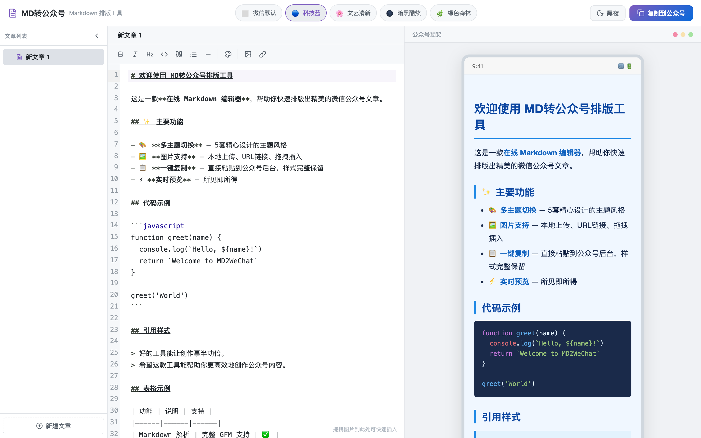
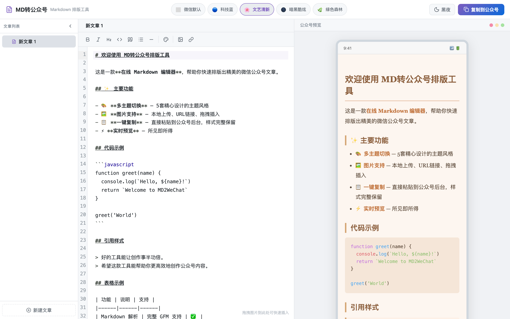
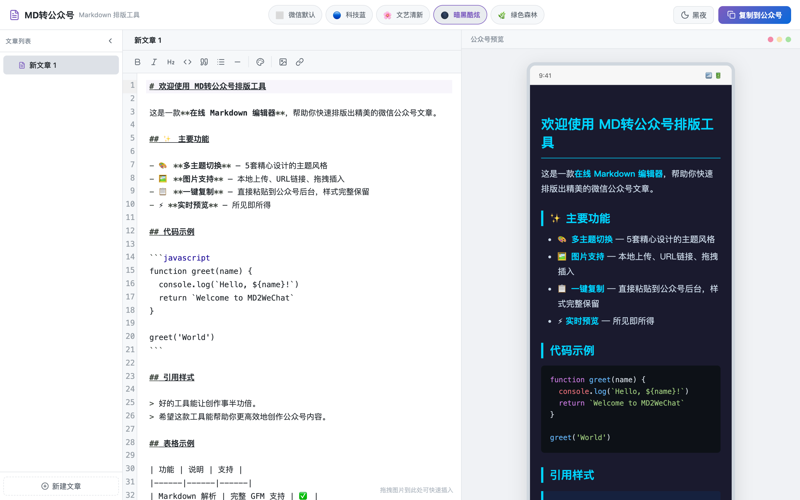
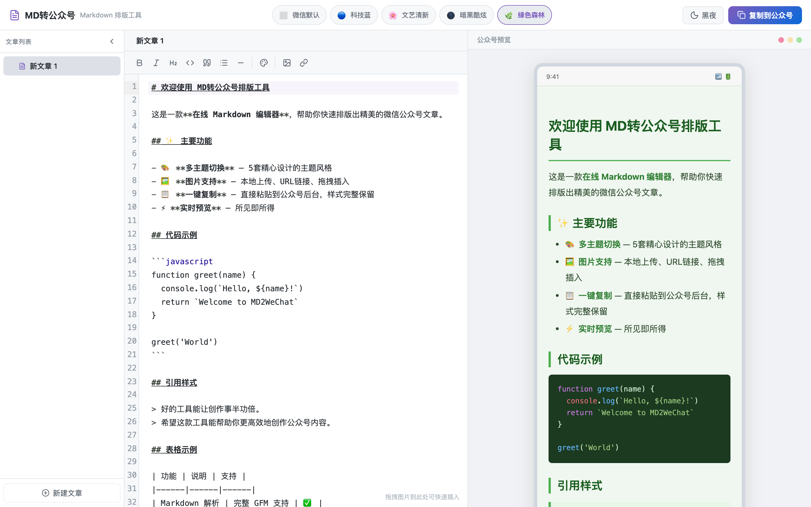
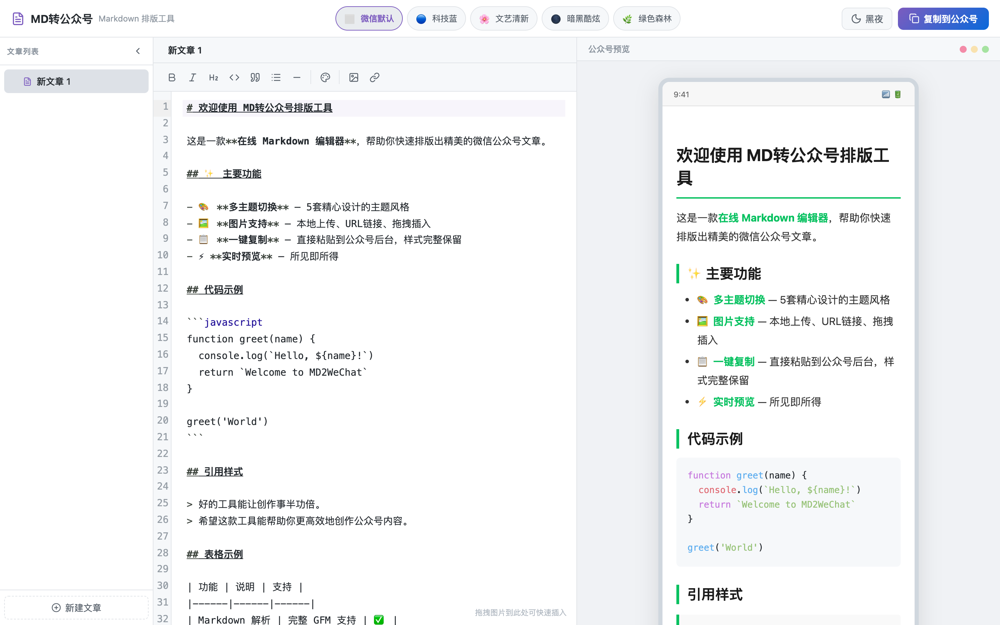
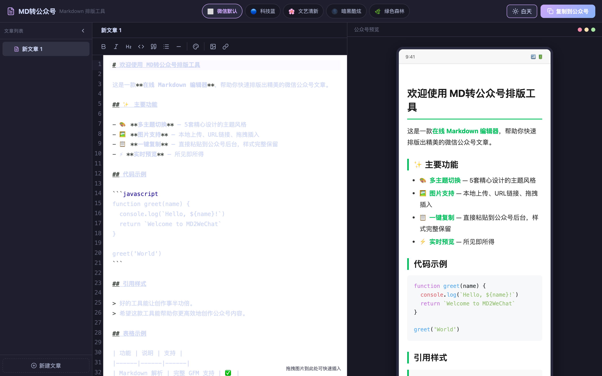

<h1 align="center">
  <br>
  MD to WeChat — Article Formatter
  <br>
</h1>

<p align="center">
  <strong>Online Markdown editor that generates beautifully styled WeChat Official Account articles</strong>
</p>

<p align="center">
  <a href="./README.md">中文</a> &nbsp;|&nbsp;
  <a href="./README_EN.md">English</a>
</p>

<p align="center">
  
  
  
  
  
</p>

<p align="center">
  <a href="#-quick-start">Quick Start</a> &nbsp;|&nbsp;
  <a href="#-features">Features</a> &nbsp;|&nbsp;
  <a href="#-theme-gallery">Themes</a> &nbsp;|&nbsp;
  <a href="#%EF%B8%8F-architecture">Architecture</a> &nbsp;|&nbsp;
  <a href="#-mcp--openclaw-integration">MCP Integration</a>
</p>

---

## 💡 About

**MD to WeChat** is an online Markdown editor designed specifically for formatting WeChat Official Account articles. Write Markdown on the left, preview the WeChat-ready result on the right, and copy with one click — **styles are 100% preserved** when pasted into the WeChat backend.

> **How it works:** `marked` parses Markdown → `highlight.js` adds syntax highlighting → `juice` inlines all CSS into each HTML tag's `style` attribute → `DOMPurify` sanitizes for XSS → produces rich-text HTML ready to paste into WeChat.

---

## ✨ Features

### Core
- 📝 **Live Markdown Editing** — Powered by CodeMirror 6 with syntax highlighting, line numbers, and auto-indent
- 👁️ **WeChat Live Preview** — 375px phone-width simulation, WYSIWYG
- 📋 **One-Click HTML Copy** — Uses `text/html` MIME type to preserve all styles when pasting into WeChat
- 🎨 **5 Beautiful Themes** — Default, Tech Blue, Literary, Dark Cyber, Green Forest
- 🌗 **Light / Dark UI Mode** — Toggle between day and night editor themes

### Multi-Article Management
- 📂 **Sidebar Article List** — Manage multiple articles in a left sidebar, click to switch
- ➕ **Create / Delete Articles** — Create unlimited articles; last article cannot be deleted
- ✏️ **Editable Titles** — Double-click sidebar title or click the editor title bar to rename
- 🔀 **Drag & Drop Reorder** — Grab the drag handle to reorder articles freely
- 💾 **Auto Persistence** — All content, themes, and order automatically saved to localStorage

### Image Support
- 📤 **Local Upload** — Auto-converts to base64, compresses images over 800KB
- 🔗 **URL Insert** — Dialog to enter image URL and alt text
- 🖱️ **Drag & Drop** — Drop image files directly into the editor

### Editor Toolbar
- **B** Bold · *I* Italic · **H2** Heading · `Code` Inline code
- > Blockquote · - List · --- Horizontal rule
- 🎨 **Text Color** — 20 preset colors + custom HEX input, colorize selected text instantly
- 🖼️ Image upload · 🔗 Image link

---

## 🎨 Theme Gallery

### ⬜ Default (WeChat Classic)
Clean and elegant, the classic WeChat Official Account style.

<p align="center">
  
</p>

### 🔵 Tech Blue
Blue-toned theme ideal for technical articles, with dark code blocks.

<p align="center">
  
</p>

### 🌸 Literary Fresh
Warm-toned literary style, perfect for book notes and lifestyle essays.

<p align="center">
  
</p>

### 🌑 Dark Cyber
Cyberpunk-style dark theme with monospace fonts, ideal for geek-flavored content.

<p align="center">
  
</p>

### 🌿 Green Forest
Fresh and natural green-toned theme for eco, health, and lifestyle content.

<p align="center">
  
</p>

---

## 🚀 Quick Start

### Prerequisites

- Node.js >= 18
- npm >= 9 (or pnpm / yarn)

### Install & Run

```bash
# Clone the repository
git clone https://github.com/your-username/md-to-weixin.git
cd md-to-weixin

# Install dependencies
npm install

# Start the dev server
npm run dev
```

Open `http://localhost:5173` in your browser.

### Build & Deploy

```bash
# Production build
npm run build

# Preview the build locally
npm run preview
```

The output is in the `dist/` directory and can be deployed to any static hosting service (Vercel, Netlify, Cloudflare Pages, GitHub Pages, etc.).

---

## 🏗️ Architecture

### Tech Stack

| Category | Technology |
|----------|-----------|
| Frontend Framework | React 19 + Vite 8 |
| Code Editor | CodeMirror 6 (`@uiw/react-codemirror`) |
| Markdown Parser | marked 17 + marked-highlight |
| Syntax Highlighting | highlight.js 11 |
| CSS Inlining | juice 11 (converts `<style>` to inline `style=""` attributes) |
| XSS Protection | DOMPurify 3 |
| State Management | Zustand 5 (with persist middleware) |
| Image Processing | browser-image-compression |
| UI Icons | lucide-react |
| Toast Notifications | react-hot-toast |

### Project Structure

```
md-to-weixin/
├── index.html
├── package.json
├── vite.config.js
├── SKILL.md                         # MCP / OpenClaw skill description
└── src/
    ├── main.jsx                     # Entry point
    ├── App.jsx                      # Root component (layout)
    ├── store/
    │   └── editorStore.js           # Zustand global state (multi-article + persistence)
    ├── themes/
    │   ├── index.js                 # Theme registry
    │   ├── default.js               # ⬜ WeChat Default
    │   ├── tech-blue.js             # 🔵 Tech Blue
    │   ├── literary.js              # 🌸 Literary Fresh
    │   ├── dark.js                  # 🌑 Dark Cyber
    │   └── green-forest.js          # 🌿 Green Forest
    ├── core/
    │   ├── markdownParser.js        # marked config + highlight.js integration
    │   └── htmlExporter.js          # Theme CSS → juice inline → DOMPurify → post-process
    ├── hooks/
    │   └── useMarkdown.js           # 300ms debounced compilation hook
    ├── components/
    │   ├── Sidebar/
    │   │   └── index.jsx            # Article list sidebar (drag & drop reorder)
    │   ├── Editor/
    │   │   ├── index.jsx            # CodeMirror editor + title bar
    │   │   └── toolbar.jsx          # Format toolbar + color picker
    │   ├── Preview/
    │   │   └── index.jsx            # Phone preview panel
    │   ├── ThemeSwitcher/
    │   │   └── index.jsx            # Theme switcher buttons
    │   └── CopyButton/
    │       └── index.jsx            # Copy HTML button
    ├── utils/
    │   ├── clipboard.js             # text/html MIME copy
    │   └── imageProcessor.js        # base64 conversion + auto compression
    └── styles/
        └── app.css                  # Global layout + light/dark CSS variables
```

### Data Flow

```
User types Markdown
  ↓ onChange (real-time)
Zustand Store (markdown field updated)
  ↓ useMarkdown Hook (300ms debounce)
marked.parse() + highlight.js syntax highlighting
  ↓
buildThemeCSS(themeVars) — expand theme variables into plain CSS
  ↓
juice(html + css) — inline CSS into each tag's style attribute
  ↓
DOMPurify.sanitize() — XSS sanitization
  ↓
postProcess() — fix image widths, clean empty attributes
  ↓
Preview renders live / One-click copy to WeChat backend
```

### WeChat Compatibility Strategy

The WeChat Official Account backend editor has many restrictions. This project handles them all:

| Limitation | Solution |
|------------|----------|
| No `<style>` tags allowed | `juice` inlines all CSS into `style=""` attributes |
| No CSS variables `var()` | Theme CSS uses literal values, no `var()` dependency |
| No `::before` / `::after` | Uses `border-left` and other properties instead of pseudo-elements |
| Images overflow container | All `` tags get `max-width:100%; height:auto` |
| Code blocks overflow horizontally | `<pre>` gets `overflow-x:auto; -webkit-overflow-scrolling:touch` |
| Rich-text paste loses styles | Uses `ClipboardItem('text/html')` MIME type for copying |

---

## 🔌 MCP / OpenClaw Integration

This project supports [Model Context Protocol (MCP)](https://modelcontextprotocol.io/) and [OpenClaw](https://openclaw.ai/) integration, serving as a Markdown formatting service in AI tool chains.

### MCP Configuration

Add the following to your MCP client config (e.g., Claude Desktop, Cursor):

```json
{
  "mcpServers": {
    "md-to-weixin": {
      "command": "npx",
      "args": ["serve", "./dist", "-l", "3000"],
      "env": {},
      "description": "Markdown to WeChat Article Formatter"
    }
  }
}
```

### OpenClaw Integration

This project provides a `SKILL.md` file compatible with the OpenClaw skill discovery protocol. AI Agents can read `SKILL.md` to understand this tool's capabilities and usage.

See [SKILL.md](./SKILL.md) for the full skill description.

### AI Tool Use Cases

| Scenario | Description |
|----------|-------------|
| Article Formatting Automation | AI generates Markdown → this tool converts to WeChat HTML |
| Batch Article Generation | Multi-article management + one-click theme switching |
| Content Review Preview | Check layout in phone preview mode |
| Style Customization | 5 themes to switch instantly, no manual CSS needed |

---

## 📸 UI Preview

### Full Interface (Light Mode)

<p align="center">
  
</p>

### Full Interface (Dark Mode)

<p align="center">
  
</p>

---

## 📋 Changelog

### v1.0.0 — Initial Release

#### Core Features
- ✅ Live Markdown editing and preview
- ✅ 5 article themes (Default / Tech Blue / Literary / Dark Cyber / Green Forest)
- ✅ One-click copy of inline-CSS HTML, paste directly into WeChat backend
- ✅ 100+ language syntax highlighting
- ✅ Three image insertion methods (local upload / URL / drag & drop)

#### Multi-Article Management
- ✅ Left sidebar article list with create / delete / switch
- ✅ Double-click to rename article titles, or click editor title bar
- ✅ Drag & drop to reorder articles
- ✅ Collapsible sidebar
- ✅ All state auto-saved to localStorage (survives page refresh)

#### Editor Enhancements
- ✅ Light / Dark UI mode toggle
- ✅ Text color picker (20 presets + custom HEX)
- ✅ Format toolbar (bold / italic / heading / code / blockquote / list / hr)

#### Technical Highlights
- ✅ Full CSS inlining via juice — 100% WeChat compatibility
- ✅ XSS sanitization via DOMPurify
- ✅ Auto image compression (>800KB handled automatically)
- ✅ 300ms debounced compilation for smooth editing
- ✅ MCP and OpenClaw integration support

---

## 🛠️ Developer Guide

### Adding a New Theme

1. Create a new theme file in `src/themes/` (e.g., `ocean.js`):

```javascript
export default {
  id: 'ocean',
  name: 'Ocean Blue',
  emoji: '🌊',
  vars: {
    '--body-bg': '#f0f8ff',
    '--text-color': '#1a3a5c',
    '--primary': '#0077b6',
    // ... see default.js for the full variable list
  }
}
```

2. Import and register it in `src/themes/index.js`:

```javascript
import themeOcean from './ocean.js'
export const THEMES = [
  // ...existing themes,
  themeOcean,
]
```

3. Done! The theme will automatically appear in the top theme switcher.

### Local Development

```bash
npm run dev        # Start dev server (HMR hot reload)
npm run build      # Production build
npm run preview    # Preview the build locally
npm run lint       # ESLint check
```

---

## 📄 License

[MIT](./LICENSE) — Free to use. A Star would be appreciated!
